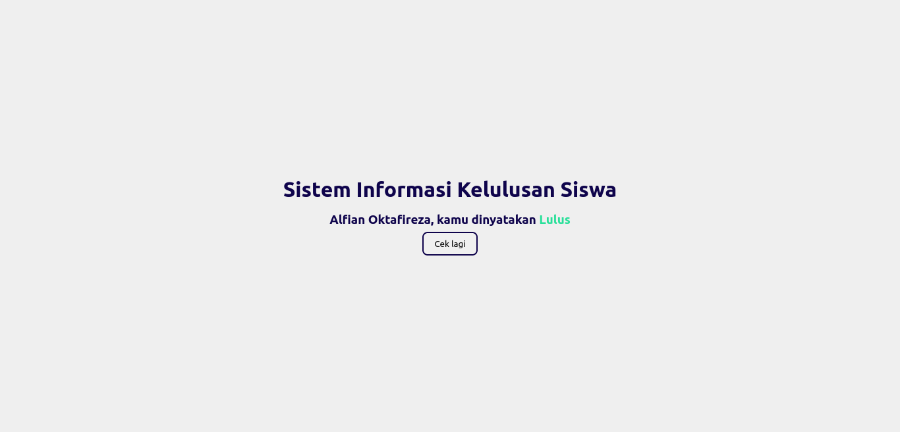

# Google Apps Script Kelulusan

Sistem Informasi Kelulusan Siswa dengan Google App Script dan SpreadSheets

## Cara kerja

- Spreadsheet dan Google Apps Script digunakan untuk menyimpan data siswa dan mengebalikan data berupa JSON, tapi ini memerlukan waktu yang cukup lama > `1000ms`
- Alih-alih langsung mengambil data dari spreadsheet kita hanya mengambil sesekali jika ada perubahan, dan datanya kita simpan di server
- Di server data di proses untuk mencari data dengan ID yang sesuai

## Instalasi

Tertarik dengan projek ini? silahkan chat saya di [suka.page.link/wa](https://suka.page.link/wa)